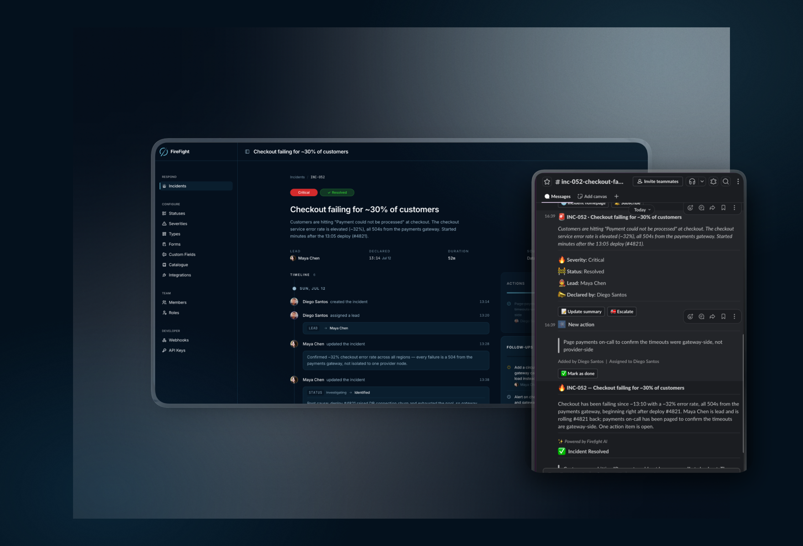

<h1 align="center">
  Firefight
</h1>
<p align="center">
  <b>Open-source, agent-ready incident management.</b><br />
  Run incidents from Slack, and let your AI agents work them too, with every action they take permissioned, approved, and on the record.
</p>

<h4 align="center">
  <a href="https://firefight.app">Website</a> ·
  <a href="#self-hosting">Self-hosting</a> ·
  <a href="#local-development">Local development</a> ·
  <a href="https://github.com/FireFightLabs/firefight/releases">Releases</a>
</h4>

<h4 align="center">
  <a href="https://github.com/FireFightLabs/firefight/blob/main/LICENSE">
    
  </a>
  <a href="https://github.com/FireFightLabs/firefight/actions/workflows/ci.yml">
    
  </a>
  <a href="https://github.com/FireFightLabs/firefight/blob/main/CONTRIBUTING.md">
    
  </a>
  <a href="https://firefight.app/slack">
    
  </a>
  <a href="https://x.com/FireFight_app">
    
  </a>
</h4>

<p align="center">
  
</p>

## What is Firefight?

Firefight runs incidents from Slack. Declare one with a slash command and it creates the channel, posts the announcement, assigns the lead, tracks every status change, keeps stakeholders updated, and generates the postmortem when it's over.

Every change is recorded as an immutable event with full attribution. The web dashboard shows that timeline alongside your service catalog, custom fields, alert routing, and API keys.

Agents can do all of it too. Connect one over MCP or the REST API and it declares incidents, reads the channel, takes action items, escalates, and writes the postmortem. It acts under its own name, reaches only what you granted it, waits for approval on the calls you marked, and every attempt is logged whether it was allowed or refused.

## Features

### Incident response
- **Slack-native flow**: declare, update status and severity, assign a lead, invite responders, escalate, and close without leaving Slack
- **Incident channels**: created automatically with pinned quick actions, topic metadata, and announcement threads
- **Audit-grade timeline**: every state change is an immutable event with full attribution
- **Custom fields and incident types**: model your organization's process, not ours
- **Incident relationships**: link related and duplicate incidents

### Built for agents
- **MCP server**: every incident action and every settings screen has a tool behind it, so an agent can run an incident or set the workspace up without touching a browser
- **Ability Gateway**: every privileged call goes through one gate. Grant abilities individually or in named sets, scope them to an environment, and hold the risky ones for human approval
- **Agents are first-class**: an agent is its own principal with its own token and its own name on the timeline. It inherits nothing from whoever created it, and no machine can mint another machine
- **Invocation ledger**: every privileged call is recorded before it runs, with who asked, what for, and whether it was allowed, refused, or held for approval
- **Governed transcripts**: an agent can read what people actually said in an incident channel, but only once an admin turns it on and grants the ability, with secrets redacted before storage and a retention window you set
- **Bring your own agent**: Claude Code, an internal support bot, whatever you already run. It connects over MCP or the API and works the incident

### AI built in
- **AI postmortems**: a structured draft generated from the incident's full timeline and channel transcript, ready for human editing
- **AI catchups**: joining an incident late? Get a summary of what's happened so far
- **Cost-tracked inference**: every AI call is logged with tokens, latency, and cost

### Platform
- **Web dashboard**: incident list with server-side filtering, incident detail with timeline, postmortem editor, settings
- **Alert ingestion and routing**: point your monitoring at a per-source endpoint, then route with first-match-wins rules that open an incident, attach to an open one, notify a team, or drop it, with deduplication, flap handling, and storm grouping so an alert storm becomes one incident
- **Service catalog**: services, teams, environments, and functionality with typed attributes and relationships
- **REST API**: the whole product over HTTP, from declaring an incident to configuring every settings screen, with bearer-token auth, granular per-key permissions, idempotency keys, and an OpenAPI document covering every operation
- **Outbound webhooks**: subscribe external systems to incident events, with delivery tracking and retries
- **Workflow engine**: durable, step-based orchestration with retries, crash recovery, and a full execution audit trail

### On the roadmap
- First-class alert adapters for Datadog, PagerDuty, and Grafana (any tool that can POST JSON works today through the generic webhook adapter)
- AI SRE investigator: autonomous, permission-gated incident investigation with evidence-backed findings
- On-call scheduling and escalation policies
- Microsoft Teams support

## Getting started

| | |
|---|---|
| **Firefight Cloud** | The fastest way to get started: managed hosting with AI features included. Coming soon at [firefight.app](https://firefight.app). |
| **Self-hosting** | Run Firefight on your own infrastructure. See [Self-hosting](#self-hosting) below. |

## Self-hosting

Firefight ships as a Docker image with every release:

```sh
docker pull ghcr.io/firefightlabs/firefight:latest
```

You'll need PostgreSQL 18+, a Slack app, and the environment variables documented in [`.env.example`](.env.example). Each [release](https://github.com/FireFightLabs/firefight/releases) includes upgrade notes; upgrading is `docker pull` plus `bin/rails db:prepare`.

## Local development

```sh
mise install                          # Ruby + Node toolchain
docker run -d --name firefight-postgres -e POSTGRES_USER=postgres \
  -e POSTGRES_PASSWORD=postgres -p 5432:5432 \
  -v firefight-postgres-data:/var/lib/postgresql postgres:18.3
bundle install
bin/rails db:prepare && bin/rails db:prepare RAILS_ENV=test
bin/dev
```

Full setup (Slack app creation, environment variables, the local tunnel for Slack callbacks, and how the multi-database layout works) is in [CONTRIBUTING.md](CONTRIBUTING.md).

## Open source vs. paid

This repository is licensed under [AGPL-3.0](LICENSE): free to use, self-host, and modify. If you run a modified version as a service, you must share your changes under the same license.

Firefight Cloud is our managed offering: hosting, upgrades, and AI features with usage included in the plan. Self-hosters bring their own LLM API key for the AI features.

## Security

Found a vulnerability? Please report it privately, see [SECURITY.md](SECURITY.md). Do not open a public issue for security problems.

## Contributing

Contributions are welcome: bug reports, fixes, and features. Start with [CONTRIBUTING.md](CONTRIBUTING.md) for the development setup and conventions, and [CODE_OF_CONDUCT.md](CODE_OF_CONDUCT.md) for how we work together. Fork PRs run the full CI suite, no secrets required.

## License

[AGPL-3.0](LICENSE) © Firefight Labs
